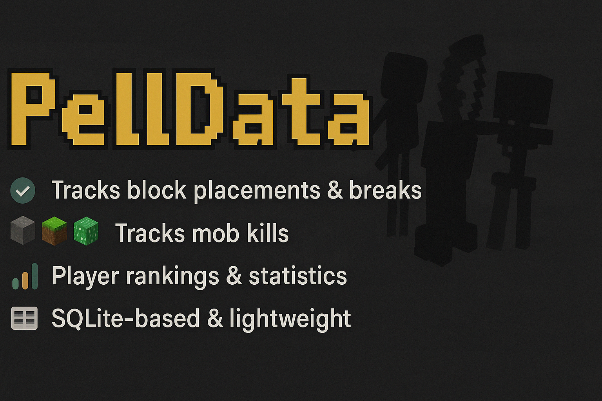

# PellData

_A lightweight and powerful player statistics plugin for your Minecraft server._  
_Ein leichtgewichtiges und mächtiges Statistik-Plugin für deinen Minecraft-Server._

---

## 📋 About / Über das Plugin

**EN:** PellData is a stats tracking plugin that logs player actions like block placements, kills, deaths, chat messages, playtime, and more.  
It supports localization, PlaceholderAPI integration, and both player and global statistics.

**DE:** PellData ist ein Statistik-Plugin, das Spieleraktionen wie Blockplatzierungen, Kills, Tode, Chatnachrichten, Spielzeit u. v. m. speichert.  
Es unterstützt Lokalisierung, PlaceholderAPI und sowohl globale als auch spielerspezifische Statistiken.

→ Data is stored in a **local SQLite database**  
→ Jeder Blocktyp wird einzeln gespeichert

> 💡 This plugin was entirely created using AI – because I wanted my own and couldn’t find a good alternative.  
> Dieses Plugin wurde vollständig mit AI entwickelt – weil ich genau sowas haben wollte.  
> 💬 Suggestions welcome!

---

## 🧩 Dependencies / Abhängigkeiten

This plugin **requires / benötigt** [PlaceholderAPI](https://www.spigotmc.org/resources/placeholderapi.6245/).

---

## 💬 Commands / Befehle

| Command / Befehl | Description / Beschreibung |
|------------------|-----------------------------|
| `/pelldata stats` | Show player stats / Spielerstatistik |
| `/pelldata stats blocks` | Blocks placed & broken / Blöcke gesetzt & abgebaut |
| `/pelldata stats killed` | Mobs killed / Getötete Mobs |
| `/pelldata stats pvp` | PvP kills |
| `/pelldata stats deaths` | Death count / Tode |
| `/pelldata stats playtime` | Total playtime / Spielzeit |
| `/pelldata stats chat` | Chat message count / Chatnachrichten |
| `/pelldata stats all` | All stats |
| `/pelldata stats topplaced` | Top 10 placed blocks |
| `/pelldata stats topbroken` | Top 10 broken blocks |
| `/pelldata stats topmobs` | Top 10 killed mob types |
| `/pelldata ranking <type>` | Leaderboard / Rangliste |
| `/pelldata player <name>` | Other player’s stats |
| `/pelldata globalstats` | Global server statistics |
| `/pelldata reset <name>` | Reset stats (with permission) |

---

## 🔐 Permissions / Berechtigungen

| Permission | Description |
|------------|-------------|
| `pelldata.reset` | Allows resetting another player’s stats |
| _default:_ `op` |

---

## 📦 PlaceholderAPI Variables / Variablen

### 👤 Player

```
%pelldata_blocks_placed%
%pelldata_blocks_broken%
%pelldata_killed_mobs%
%pelldata_pvp%
%pelldata_deaths%
%pelldata_playtime%
%pelldata_chat%
```

### 🔄 Player (named)

```
%pelldata_blocks_placed_Talonachris%
%pelldata_chat_Notch%
```

### 🌍 Global

```
%pelldata_global_blocks_placed%
%pelldata_global_blocks_broken%
%pelldata_global_killed_mobs%
%pelldata_global_pvp%
%pelldata_global_deaths%
%pelldata_global_playtime%
%pelldata_global_chat%
```

---

## 🌐 Localization / Lokalisierung

Languages: `en_us`, `de_de`  
Sprache konfigurierbar in `config.yml`:

```yml
language: de_de
```

---

## 💛 Credits

Made by Talonachris – powered by PlaceholderAPI.  
Built with 💡 AI, love, and the desire for better Minecraft stats.

